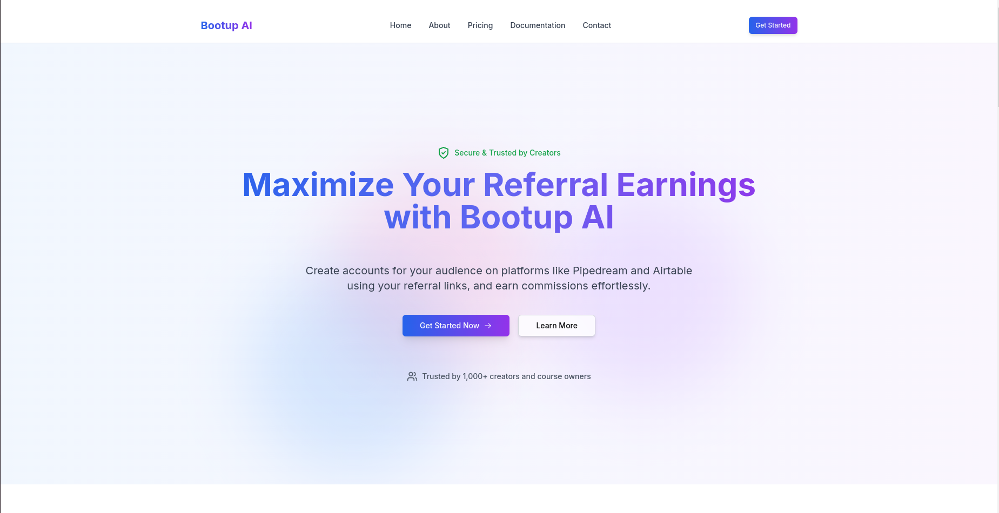

# Bootup AI

**The Missing Link in Referral Marketing**


## 🚀 Overview

Bootup AI is an innovative open-source platform that revolutionizes the referral marketing landscape by making it effortless for influencers, content creators, and everyday users to monetize their audiences through service referrals. Our platform solves a critical market inefficiency: the billions in unclaimed referral rewards that companies offer but users rarely utilize.

## 💡 The Problem We Solve

In today's digital ecosystem, service platforms offer generous referral rewards, but these opportunities often go unrealized because:

1. Referral processes are typically cumbersome
2. Users forget to apply referral codes during sign-up
3. Content creators lack efficient tools to track and maximize referral conversions
4. The technical barriers to implementing referral systems are high

## 🌟 Our Solution

Bootup AI provides a streamlined, user-friendly platform that:

- **Simplifies Referral Creation**: Users can generate custom referral links in seconds
- **Eliminates Friction**: Audience members can create accounts through referral links without needing to manually input codes
- **Ensures Reliability**: Our worker system handles the account creation process seamlessly in the background
- **Provides Integration Flexibility**: Currently supporting Pipedream, with Zapier and Make.com integrations coming soon

## 🔍 How It Works

1. **Referrers sign up** on Bootup AI and authenticate with their service accounts
2. They **create custom referral links** for their preferred services
3. These links are **shared with their audience** through content, social media, or other channels
4. Audience members **click the link and enter credentials** for account creation
5. Our system **automatically applies the referral code** during the account creation process
6. **Both parties receive benefits** - the new user gets any referral bonuses, and the referrer earns rewards

## 🖥️ Platform Preview

Here's a glimpse of the Bootup AI experience:


*The intuitive Bootup AI dashboard provides at-a-glance performance metrics.*


*supports multi-platform authentication, including Google, GitHub, and email login, for secure and flexible access*


*Creating personalized referral links takes just seconds.*


*Comprehensive analytics help users optimize their referral strategy.*


*Secure account creation via referral link—users enter credentials with full transparency, as no data is stored.*

## 🛠️ Technology Stack

Bootup AI is built using modern, scalable technologies:

- **Frontend**: Next.js, React, Tailwind CSS
- **Backend**: Node.js, Express
- **Worker System**: Distributed architecture for reliable account creation
- **Database**: PostgreSQL with Prisma ORM
- **Authentication**: NextAuth.js (supports Google, GitHub, and email login)
- **Analytics**: Real-time tracking and reporting

## 🔮 Roadmap

- **Q2 2025**: Launch of Zapier and Make.com integrations
- **Q3 2025**: User feedback system for gathering feature requests and improvements
- **Q4 2025**: Enterprise version with custom customization options

## 💼 Business Model

Bootup AI operates on a freemium model:

(Currently planning—details to be finalized)
## 👥 Target Market

- **Content Creators**: YouTubers, bloggers, podcasters
- **Influencers**: Social media personalities with engaged audiences
- **Businesses**: Companies looking to implement customer referral programs
- **Affiliate Marketers**: Individuals monetizing through product recommendations

## 🛡️ Open Source Commitment

Bootup AI is committed to the open-source community. We believe in:

- **Transparency**: Our code is open for review and contribution
- **Collaboration**: We welcome developers to enhance and extend our platform
- **Innovation**: Community-driven development leads to better solutions for everyone

## 🚀 Getting Started

### Prerequisites

- **Node.js** (v16+)  
- **npm** or **yarn**  
- **Database**: PostgreSQL  
- **Redis** (Required for BullMQ-based job queues)  
- **Other dependencies**:  
  - Prisma ORM (`prisma`, `@prisma/client`)  
  - NextAuth.js for authentication  
  - TailwindCSS for styling  
  - BullMQ for job processing  
  - React Hook Form for form validation  
  - [Lemon.email](https://lemon.email/) for email handling  
### Installation

```bash
# Clone the repository
git clone https://github.com/manojk0303/bootupai.git

# Navigate to the project directory
cd bootupai

# Install dependencies
npm install

# Set up environment variables
cp .env.example .env

# Run the development server
npm run dev
```

### Configuration

1. Create accounts on supported services (Pipedream, etc.)
2. Configure your API keys in the `.env` file
3. Set up your database connections

## 🤝 Contributing

We welcome contributions from the community! Please see our [CONTRIBUTING.md](CONTRIBUTING.md) for guidelines.

## 📄 License

Bootup AI is licensed under the [MIT License](LICENSE).

## 📬 Contact

- **Email**: manojk030303@gmail.com
- **Twitter**: [@BootupAI](https://x.com/bootupai)
- **GitHub**: [github.com/manojk0303/bootupai](https://github.com/manojk0303/bootupai)

---

*Bootup AI - Unlocking the full potential of referral marketing*
